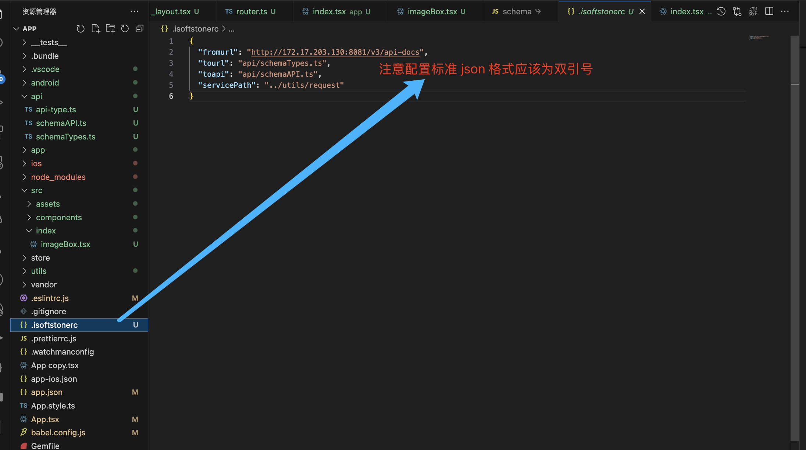
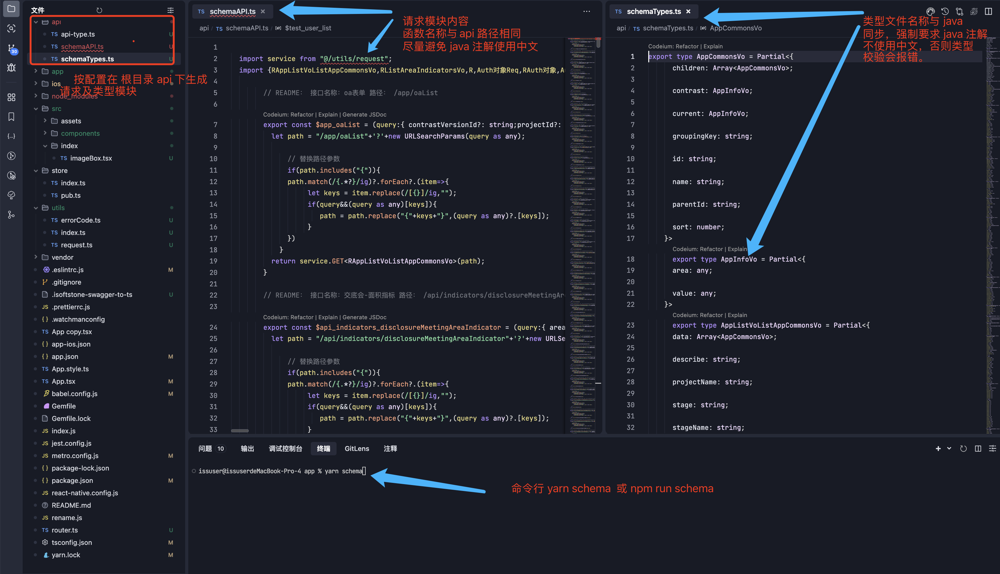
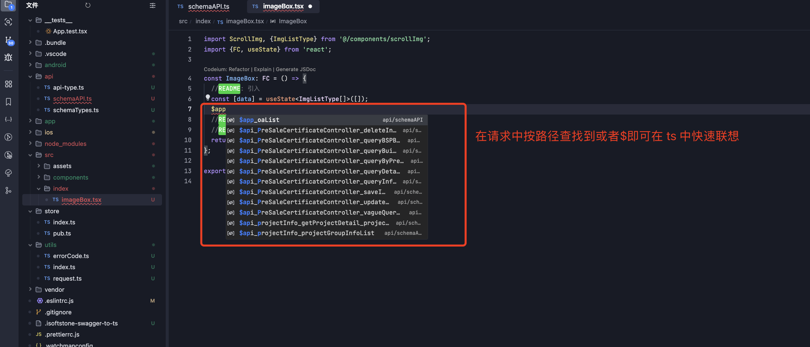

# swagger-to-ts

通过 swagger 转换出请求和 ts 类型，在根目录下生成 api 文件夹，schemaAP.ts 为请求，schemaType.js 为类型定义。

#### 安装

```
npm install isoftstone-swagger-to-ts    // 或者
yarn add isoftstone-swagger-to-ts
```

### 配置 .isoftstonercrc 在项目根目录创建.isoftstonerc 文件

- fromurl 服务端 swagger api 地址
- tourl 本地生成 ts 类型 ts 文件地址，默认为“/api/schemaTypes.ts“
- toapi 本地生成请求函数 ts 文件地址，默认 为 ”/api/schemaTypes.tsÏ“
- servicePath Axios 本地实例地址

```Ï
在项目根目录创建 .isoftstonerc 文件并配置如下
{
"fromurl":"http://xxxx/api/",
"tourl":"/api/schemaTypes.ts",
"toapi":"/api/schemaAPI.ts",
"servicePath":"@/utils/request"
}
```

### 运行

会在配置目录下生成对应请求函数文件和类型文件

```
npm run schema  //或者

yarn schema
```

### 示例

1. 配置

   

2. 命令行及文件输出

   

3. 开发中导入

   
